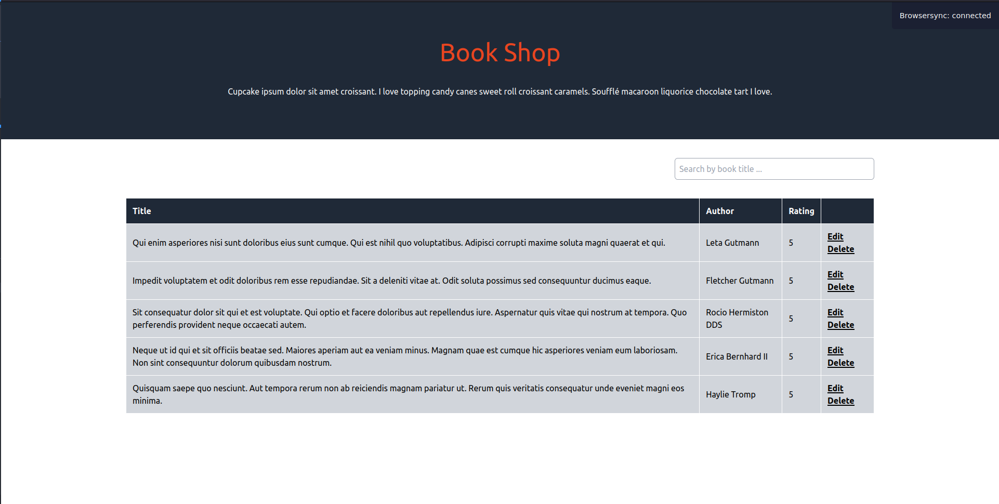
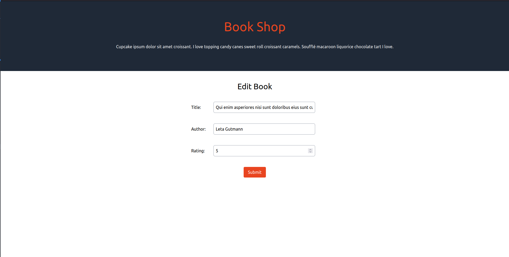

## Book Shop

To Set Up the application run the following in the application directory

```
composer install
./vendor/bin/sail up
```

then in a new terminal run

```
docker exec -it book-shop php artisan migrate
docker exec -it book-shop php artisan db:seed
npm install
npm run watch
```

You can then go to `localhost` in your browser, the landing page will be empty.


Designs

-   'book-shop-listing.png'
    

-   'edit-book-filled.png'
    
